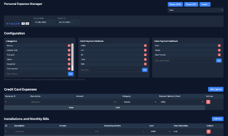
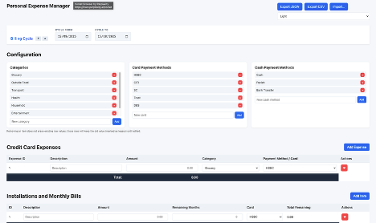

# Personal Expense Manager (Client‑Side)

  -informational)   [](https://personal-expense-manager.pages.dev/)

Pure HTML / CSS / Vanilla JavaScript · No build step · Private & offline capable.

A zero‑backend, single‑page personal expense manager for tracking credit card expenses, installments, fixed costs, and cash spending with live projections and fully configurable categories & payment methods.

➡️ Live Demo: [personal-expense-manager.pages.dev](https://personal-expense-manager.pages.dev/)

Offline note: The app is fully client-side and can be saved locally (File > Save Page As) for offline use. No service worker yet; after a hard refresh you need connectivity only to re-load the static assets (or host them locally).

## 1. Feature Summary

| Area | Included | Notes |
|------|----------|-------|
| Credit Card Expenses | ✅ | Dynamic rows, category + card assignment |
| Installments / Monthly Bills | ✅ | Auto total remaining, monthly roll-up |
| Fixed Costs | ✅ | Monthly obligations added to projection |
| Cash Expenses | ✅ | Separate payment method list |
| Dynamic Configuration | ✅ | Add/remove categories & payment methods (legacy preserved) |
| Billing Cycle (15th→15th) | ✅ | Auto-detected current cycle + prev/next buttons |
| Live Projections | ✅ | Spend projection, bill projection, savings calc |
| Import / Export JSON | ✅ | Full data model + expected income + configurable lists |
| Import / Export CSV | ✅ | Multi-section format with expectedIncome + lists |
| Expected Income Field | ✅ | Drives savings metric; persisted in export |
| Theme Selector | ✅ | Light, Dark, Dracula, VSCode, Pink (header dropdown, persisted) |
| Expense Distribution Charts | ✅ | Live pie charts by Category & Payment/Card |
| Accessibility Basics | ✅ | Native controls, labels, focus outlines |
| Undo / Edit Modes | ❌ (Removed) | Simplified immediate edits & deletes |
| Persistence (Local Storage) | ❌ | Future enhancement idea |
| Auth / Multi-user | ❌ | Intentionally out of scope |

## 2. Screenshots & Demo Preview

| View | Dark Theme | Light Theme | Description |
|------|------------|-------------|-------------|
| Main Dashboard |  |  | Core tables + summary metrics |
| Billing Cycle & Themes |  | — | Shows cycle shifting + theme switching |
| Import / Export |  | — | Data portability workflow |

Live interactive version: [Open the Live Demo](https://personal-expense-manager.pages.dev/) (always latest main branch build).

Accessibility: Ensure each image has descriptive alt text (as above) for screen readers.

## 3. Quick Reference

Common tasks at a glance:

| Action | How |
|--------|-----|
| Add credit card expense | Use "Add Expense" button below the credit card expenses table |
| Jump to table bottom | Use the small "↓ bottom" link near any table heading |
| Add expense via keyboard | Press Alt + A (when not focused in an input) |
| Remove any row | Click trash icon in its row |
| Shift billing cycle forward | Up (▲) arrow beside Billing Cycle heading |
| Shift billing cycle backward | Down (▼) arrow beside Billing Cycle heading |
| Add new category/card | Enter name in Configuration block → Add (bottom inline input) |
| Export data | Use Export JSON or Export CSV buttons (header) |
| Import data | Click Import… and choose previous JSON/CSV export |
| Open live demo | Visit the deployed site: [personal-expense-manager.pages.dev](https://personal-expense-manager.pages.dev/) |
| View totals by category | See "Totals by Category" summary table |
| Update expected income | Edit numeric field in Summary panel |
| Remaining budget | See "Remaining Budget" metric |
| Save work | Export (no automatic persistence) |
| Change theme | Use theme dropdown (top right) |

## 4. Overview

This project is a lightweight browser-only expense dashboard. All data lives in the page until you export it (JSON or CSV).

It supports:

* Multiple spending domains (Card Expenses, Installments, Fixed Costs, Cash Expenses)
* Live per-category and per-card summaries
* Monthly projection + fixed cost inclusion + projected savings estimation
* Dynamic configuration of Categories, Card Payment Methods, and Cash Payment Methods at runtime
* Safe retention of removed option values (marked as legacy) in existing rows

No frameworks, no bundlers, no tracking — just open `index.html` and start entering data.

## 5. Quick Start

1. Clone or download the repository.
2. Open `index.html` in any modern browser (Chrome, Edge, Firefox, Safari).
3. (Optional) Set your billing cycle dates at the top.
4. Enter or import data, adjust configuration lists, and review live summaries.
5. Export when you want to persist or share.

## 6. Core Data Areas

| Section | Purpose | Key Fields |
|---------|---------|-----------|
| Credit Card Expenses | One-off or normal card transactions | Description, Amount, Category, Card (Payment Method) |
| Installments & Monthly Bills | Items paid monthly for N remaining months | Description, Monthly Amount, Remaining Months, Card, Computed Total Remaining |
| Fixed Costs | Recurring fixed monthly obligations | Description, Amount |
| Cash Expenses | Non-card spending (cash / transfers / wallets) | Description, Amount, Cash Payment Method, Category |

## 7. Configuration (Dynamic Lists)

Located in the “Configuration” section:

* Categories
* Card Payment Methods
* Cash Payment Methods

### Adding

Type a unique name and press Add (or Enter). All existing dropdowns refresh automatically.

### Removing

Click the “x” next to an entry. Existing rows preserving the removed value retain it as a selectable option labelled with “(legacy)” until you manually change it.

### Legacy Handling

Removed options still in use are appended as trailing options in affected selects with class `legacy-option` so historical data isn’t broken.

## 8. Live Metrics (Summary Panel)

The Summary section displays these live-calculated values:

* Total Credit Card Bill – Sum of all current credit card expense amounts
* Total Installment Cost (Monthly) – Sum of monthly installment amounts
* Days Remaining in Cycle – Inclusive cycle length minus elapsed days (current day excluded from remaining)
* Monthly Expected Income – User input field (also exported/imported)
* Total Fixed Costs – Sum of fixed costs
* Total Cash Expenses – Sum of all cash expense amounts
* Expected Savings (Input) – User-entered target savings for the month
* Remaining Budget – `Expected Income - (Card Total + Installment Monthly + Fixed Costs + Expected Savings Input)`
* Remaining Budget Per Day – Remaining Budget divided by days remaining ("Not Applicable" if out of cycle)
* Projected Savings – Same as Expected Savings (Input) displayed

## 9. Table Footers & Computations

* Card Expenses footer: total of all card amounts
* Installments footer: sum of monthly amounts + sum of computed remaining totals (monthly * remaining months)
* Fixed Costs footer: total amount
* Cash Expenses footer: total amount

Installment row “Total Remaining” updates whenever Amount or Remaining Months changes.

## 10. Interactions

* Add Row buttons create new blank rows (auto ID).
* Trash icon button on each row removes it immediately (no undo).
* Inputs/selects update summaries and projections in real time.
* Billing Cycle auto-sets on first load to the cycle containing today, defined as the 15th of one month through the 15th of the next month.
* Use the small arrow buttons beside the Billing Cycle heading to shift backward (down arrow) or forward (up arrow) by one full cycle (15th→15th). Multiple clicks queue additional month shifts.

## 11. Import & Export

Buttons: Export JSON, Export CSV, Import… (choose a previously exported file).

### JSON Schema

```json
{
  "cycleStart": "YYYY-MM-DD",
  "cycleEnd": "YYYY-MM-DD",
  "expectedIncome": 0,
  "expectedSavings": 0,
  "categories": ["Grocery", "Outside Food", "..."] ,
  "cardPaymentMethods": ["HSBC", "CITI", "SC"],
  "cashPaymentMethods": ["Cash", "Paylah", "Bank Transfer"],
  "expenses": [ { "description": "", "amount": 0, "category": "", "payment": "" } ],
  "installments": [ { "description": "", "amount": 0, "remainingMonths": 0, "card": "" } ],
  "fixedCosts": [ { "description": "", "amount": 0 } ],
  "cashExpenses": [ { "description": "", "amount": 0, "paymentMethod": "", "category": "" } ]
}
```

Row IDs are regenerated sequentially; only semantic fields persist.

### CSV Multi-Section Format

Sections in order (blank line between): Cycle, Categories, CardPaymentMethods, CashPaymentMethods, Expenses, Installments, FixedCosts, CashExpenses.

```csv
# Cycle
cycleStart,cycleEnd,expectedIncome,expectedSavings
2025-10-01,2025-10-31,4500

# Categories
category
Grocery
Transport

# CardPaymentMethods
card
HSBC
DBS

# CashPaymentMethods
method
Cash
Paylah

# Expenses
description,amount,category,payment
Groceries,45.90,Grocery,DBS

# Installments
description,amount,remainingMonths,card
Phone Plan,30.00,6,HSBC

# FixedCosts
description,amount
Rent,1200

# CashExpenses
description,amount,paymentMethod,category
Market Veg,18.25,Cash,Grocery
```

Quoted fields and escaped quotes (`""`) are supported.

### Import Behavior

* Clears existing rows first
* Recomputes all summaries automatically
* Missing sections are treated as empty arrays
* Unknown option values are preserved as legacy entries

### Validation

* Invalid JSON → simple alert
* CSV lines with insufficient columns for a section are skipped silently

## 12. Data Model (In-Memory)

```ts
interface Expense { description: string; amount: number; category: string; payment: string; }
interface Installment { description: string; amount: number; remainingMonths: number; card: string; }
interface FixedCost { description: string; amount: number; }
interface CashExpense { description: string; amount: number; paymentMethod: string; category: string; }
interface ExportModel {
  cycleStart: string;
  cycleEnd: string;
  expenses: Expense[];
  installments: Installment[];
  fixedCosts: FixedCost[];
  cashExpenses: CashExpense[];
}
```

## 13. Performance & Limits

Designed for personal-scale usage (hundreds of rows). All operations are DOM-based; no virtualized rendering.

## 14. Accessibility Notes

* All inputs are native HTML controls
* Tab order follows document flow
* (Potential improvement) Add ARIA labels for summary metrics

## 15. Customization Ideas

| Enhancement | Description |
|-------------|-------------|
| Local Storage Persistence | Auto-save & load last session |
| Combined Category Summary | Merge card + cash categories |
| Currency Support | Multi-currency display & conversion |
| Dark Mode | Themed alternative stylesheet |
| Installment Auto-Progress | Decrement remaining months at cycle rollover |
| Validation Layer | Highlight incomplete/invalid rows |

## 16. Development

No build tools required.

1. Edit files directly (`index.html`, `css/styles.css`, `js/app.js`).
2. Refresh browser.
3. Use browser dev tools to inspect runtime state.

## 17. Known Constraints

* No persistence unless you export
* No multi-user or sync
* Deleting a row is irreversible (no undo)
* No sorting or filtering built-in

## 18. Security & Privacy

* All data stays in your browser tab
* Exports are plain text files you control
* No external network requests

## 19. License

MIT — do whatever you like; attribution appreciated but not required.

## 20. Deployment

Current Hosting: Deployed via Cloudflare Pages at [personal-expense-manager.pages.dev](https://personal-expense-manager.pages.dev/).

Why Cloudflare Pages:

* Zero-cost static hosting for HTML/CSS/JS
* Automatic CDN + HTTPS
* Quick redeploys on pushes


Deployment Steps (Cloudflare Pages):

1. Push changes to the `main` (or designated) branch.
2. Cloudflare Pages project is connected to the repository; it auto-builds (no build command needed — set "None").
3. After build completes, the new version is live globally.


Manual Alternative:

1. Run locally: just open `index.html`.
2. Host from any static provider (GitHub Pages, Netlify, Vercel). No build config required.


Local Offline Copy:

* Save the page (File > Save Page As) including resources OR clone the repo and open `index.html`.
* Optional: Serve via a simple local server (Python `python3 -m http.server 8080`) for consistent relative path handling.


Future Enhancement (Optional):

* Add a service worker for full offline-first loading after first visit.

## 21. Changelog (High Level)

* Initial: Core tables + summaries
* Added: Installments, Fixed Costs, Cash Expenses
* Added: Projection & projected savings metrics
* Added: JSON / CSV import-export
* Added: Dynamic configuration (categories & payment methods)
* Simplified: Removed edit/save modal & undo (immediate delete only)
* UI: Renamed Expenses table to Credit Card Expenses
* UI: Added Billing Cycle auto-default (15th→15th) with previous/next cycle shift buttons
* UI: Replaced textual Delete with trash icon button
* Data: Added expectedIncome to export/import (JSON + CSV cycle section)
* Deploy: Public live demo published at personal-expense-manager.pages.dev
* UI: Renamed "Expected Savings" metric label to "Projected Savings" for clarity
* Data/UI: Added expectedSavings field (manual savings target) to JSON & CSV export/import
* UI: Added Remaining Budget & Remaining Budget Per Day metrics with negative highlight styling
* UI: Added quick "↓ bottom" jump links for large tables and Alt + A shortcut to add a new expense row
* UI: Added Pink theme option (new color palette)
* UI: Added live expense distribution pie charts (Category & Payment/Card)

---
Enjoy budgeting! If you extend this (storage, themes, analytics), consider contributing your variant back.
